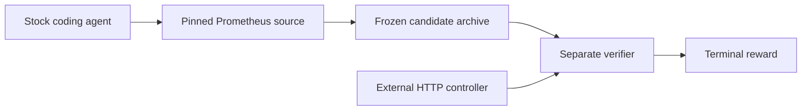

# First episode: fixed-time PromQL subqueries

## Outcome

Repair the fixed-time subquery regression represented by Prometheus PR #19187. Instant and range evaluation must agree across nested, `@`, offset, constant, and step-varying cases without changing ordinary subquery behavior.

The agent-visible request is [instruction.md](../task_support/prometheus/tasks/step-invariant-subquery/instruction.md). It reports the public symptom and reproducer, but does not name a source file, command, root cause, helper, or reference patch.

## Episode

- Source: exact clean first parent `38c29bc2e26f6fe52d347c6d325552cf68810454`.
- Environment: Go 1.26 container with Git-stripped Prometheus source and a prewarmed build cache. The actor can reach its model provider.
- Agent: stock coding agent running as a non-root user.
- Handoff: checksum-addressed source archive collected after the agent phase.
- Verifier: separate no-network image. A trusted controller drives the candidate Prometheus daemon over HTTP and checks verifier-owned PromQL cases.
- Reward: one terminal Harbor reward after compile and behavioral checks.

The production fix is small, but patch size alone does not establish model difficulty. Two fixed-model calibration runs are in progress.

## Evidence

The clean parent fails five original fixed-time assertions. The exact #19187 reference passes the external controller's instant, range, nested, numeric, `start()`, `end()`, offset, and ordinary-query cases.

Across frozen Daytona runs, both exact-reference trials returned `1`, both no-op trials returned `0`, the alternate-valid implementation returned `1`, and both named mutants returned `0`. Stock-agent difficulty remains open.

